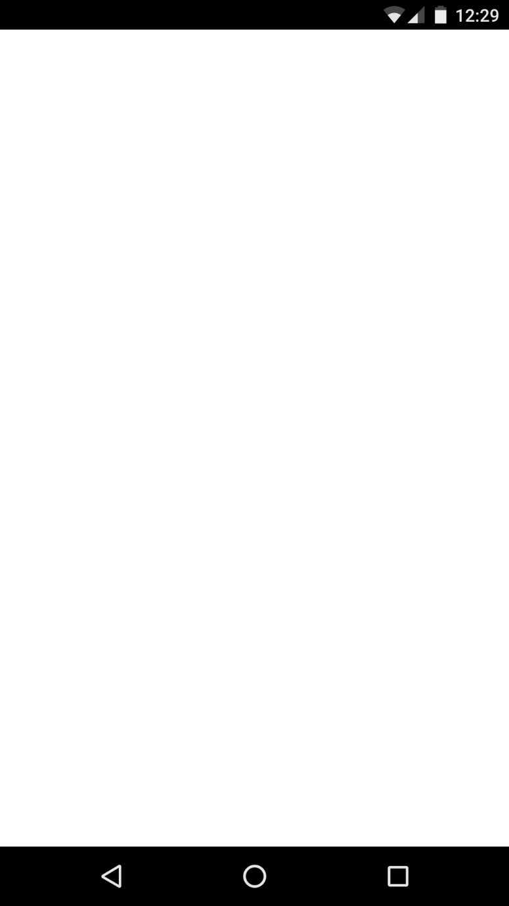
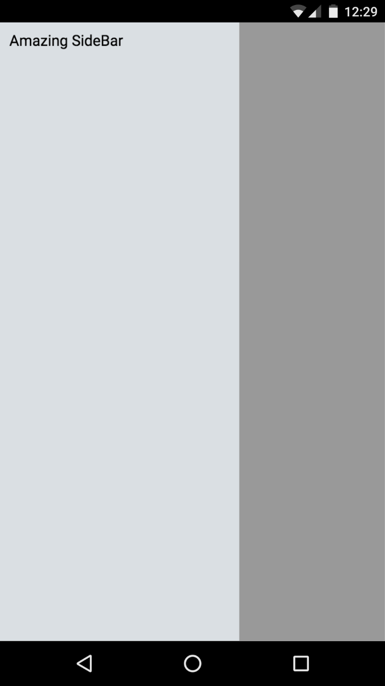
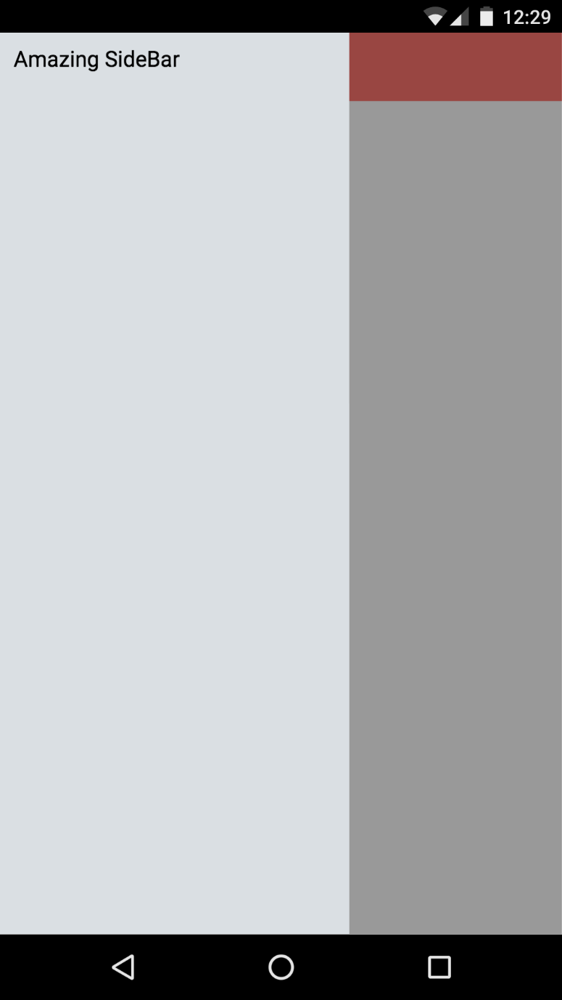
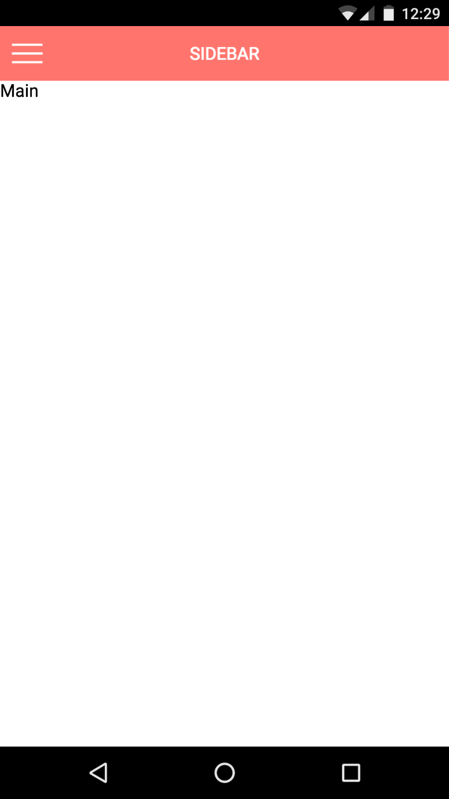
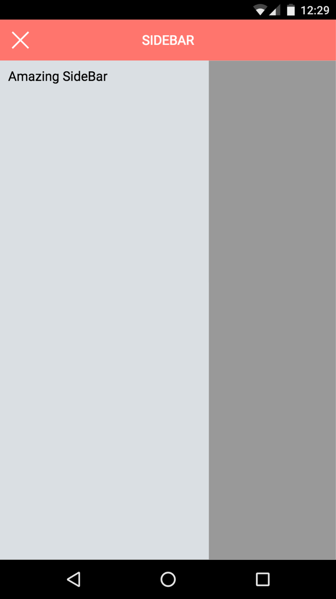
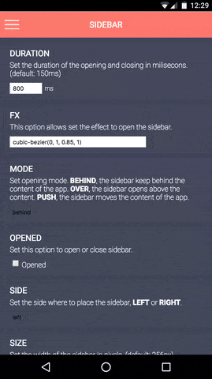
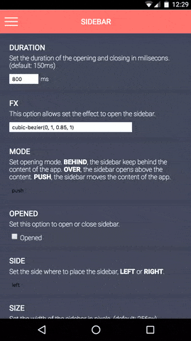

# React Sidebar Component
## react-side-bar

[](https://www.paypal.com/cgi-bin/webscr?cmd=_donations&business=mschezes%40gmail%2ecom&lc=ES&item_name=Miguel%20S%c3%a1nchez&item_number=github&no_note=0&currency_code=EUR&bn=PP%2dDonationsBF%3abtn_donate_SM%2egif%3aNonHostedGuest) [](http://badge.fury.io/js/react-side-bar) []() [](https://opensource.org/licenses/MIT)


## Instalación
Para instalar `react-side-bar` solo tienes que ejecutar:

```
npm install --save react-side-bar
```

cuando este proceso termine, ya podrás importar `react-side-bar` en tu proyecto.


## Cómo usar
Para empezar a usar `react-side-bar` tienes que importar el componente en tu proyecto:

```javascript
import Sidebar from 'react-side-bar';
```

Una vez importado hay que crear un objecto para pasar las propiedades al componente.
Es obligatorio pasar la propiedad `bar`. Esta propiedad, es en realidad un nodo de **React** que será nuestra `Sidebar`.

```javascript
const sidebarProps = {
	bar: (<div>Amazing Sidebar</div>),
	size: 200
};
```

Puedes configurar `react-side-bar` con más propiedades. Puedes verlas en [Propiedades](#propiedades).

### Boton para abrir la barra lateral

Si tu intención es la de tener un botón (tipo *menú hamburguesa* por ejemplo) que abra y cierre `react-side-bar` es necesario que tengas una referencia en el estado de tu clase para saber si `react-side-bar` está abierto o no.

```javascript
constructor(props) {
	this.state = {
		opened: false (or true)
	}
}
```
en este caso, hay dos propiedades que son obligatorias:

* **onOpen** (function)
* **onClose** (function)

El cometido de estas funciones es el de mantener actualiza la propiedad *abierto* del componente. Para ello, deben llamar a `setState` para hacer un cambio de valor de la propiedad. Por ejemplo:

Para cerrar:

```javascript
onClose: () => {
	setState({ opened: false })
}
```

Para abrir:

```javascript
onOpen: () => {
	setState({ opened: true })
}
```

Además puedes utilizar estas funciones para agregar funcionalidad extra a tu aplicación como disparadores de cuando se abre o cierra `react-side-bar`.

El objeto con las propiedades de *onClose*, *onOpen* quedaría así:

```javascript
const sidebarProps = {
	bar: (<div>Amazing Sidebar</div>),
	opened: this.state.opened,
	onClose: () => {
		setState({ opened: false })
	},
	onOpen: () => {
		setState({ opened: true })
	},
	size: 200
};
```

Una vez que tengamos el objecto con las propiedades, inicializamos el componente `Sidebar` esas propiedades.

```javascript
<Sidebar {... sidebarProps} />
```

también puede definirse de la siguiente forma:

```javascript
<Sidebar
	bar={(<div>Amazing Sidebar</div>)}
	size={300} />
```

El resultado de esta configuration sería algo así:




Para añadir contenido a la aplicación únicamente tendremos que añadir hijos al componente.

```javascript
<Sidebar {... sidebarProps}>
	<div className='topBar'>SIDEBAR</div>
	<div className='main'>Main</div>
</SideBar>
```

Con algo de estilo y alguna mejora, podría quedar algo así:




En el anterior ejemplo, se creó un *div* con el estilo necesario para crear una barra superior pero con `react-side-bar` podemos pasarle este componente con la barra superior como propiedad para modificar el efecto de apertura del componente.

```javascript
const sidebarProps = {
	bar: (<div>Amazing Sidebar</div>),
	topBar: (<div className='topBar'>SIDEBAR</div>),
	size: 300
};

<Sidebar {... sidebarProps}>
	<div className='main'>Main</div>
</SideBar>
```





## Propiedades

#### duration (*number*)
> Valor por defecto: *150*

Es el tiempo que tarda la animación de apertura de la barra lateral.


#### fx (*string*)
> Valor por defecto: *cubic-bezier(0, 1, 0.85, 1)*

Es el efecto que hace la barra lateral para abrirse, puedes probar tu efecto en [http://cubic-bezier.com](http://cubic-bezier.com/#0,1,.85,1) o pasar otro efecto diferente. [Efectos](https://developer.mozilla.org/es/docs/Web/CSS/transition-timing-function)

#### mode (*string*: **Sidebar.BEHIND** | **Sidebar.OVER** | **Sidebar.PUSH**)
> Valor por defecto: *Sidebar.OVER*

Es la modo de apertura de la barra lateral, hay tres formas disponibles:

* **Sidebar.BEHIND**



* **Sidebar.OVER**


* **Sidebar.PUSH**



#### opened (*boolean*: **true** | **false**)
> Valor por defecto: *false*

Indica si la barra está abierta o cerrada. Puede usarse para iniciar el componente mostrando la barra lateral.

#### side (*string*: **Sidebar.LEFT** | **Sidebar.RIGHT**)
> Valor por defecto: *Sidebar.LEFT*

Indica el lado por el que debe abrirse la barra lateral.

#### size (*number*)
> Valor por defecto: *256*

Esta propiedad indica el ancho de la barra lateral en pixeles.

#### tolerance (*number*)
> Valor por defecto: *70*

Indica la facilidad con la que se abrirá la barra lateral. Cuanto más alta sea la tolerancia habrá que desplazar más la barra lateral para que se habrá automáticamente.

#### touch (*boolean*: **true** | **false**)
> Valor por defecto: *true*

Indica si se permiten los eventos táctiles. Si su valor es false, habría que añadir un método alternativo de apertura como por ejemplo un *menu hamburguesa*

#### touchSize (*number*)
> Valor por defecto: *80*

Esta propiedad indica cual es el tamaño de pantalla en el que se puede tocar para empezar a desplegar la barra lateral. Si es 0 significa que puedes arrastrar desde cualquier punto de la pantalla.

#### veilStyle (*object*)
> Valor por defecto: *{}*

Estilo final del velo que cubre el contenido de la aplicación cuando la barra lateral está abierta. Durante la transición se añade un opacidad dependiendo del porcentaje de apertura.


## Ejemplo

Puedes ver el ejemplo en [Ejemplo](https://mschez.github.io/react-side-bar/example).

O descargando (o clonando) el proyecto y haciendo doble click en `index.html` dentro de la carpeta `example`.


## Contibución

Si quieres hacer tus propias modificaciones, compartirlas con la comunidad y contribuir al proyecto:

```
git clone https://github.com/mschez/react-side-bar.git
cd react-side-bar
npm install
npm run dev
```

Ahora podrás probar el ejemplo en [http://localhost:3000](http://localhost:3000)

Recuerda activar el modo dispositivo para poder probar los eventos táctiles.


## Importante

No te olvides de invitarme a una cerveza. ¡Gracias!

[](https://www.paypal.com/cgi-bin/webscr?cmd=_donations&business=mschezes%40gmail%2ecom&lc=ES&item_name=Miguel%20S%c3%a1nchez&item_number=github&no_note=0&currency_code=EUR&bn=PP%2dDonationsBF%3abtn_donate_SM%2egif%3aNonHostedGuest)